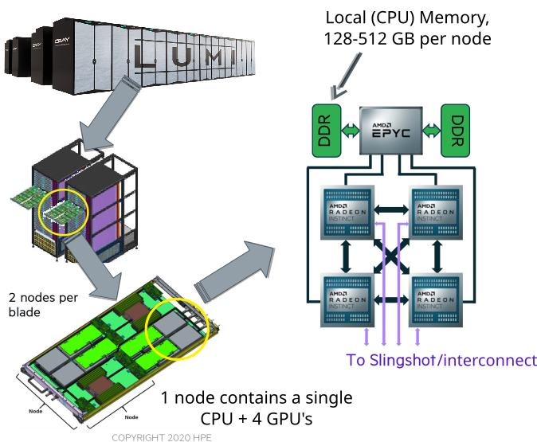
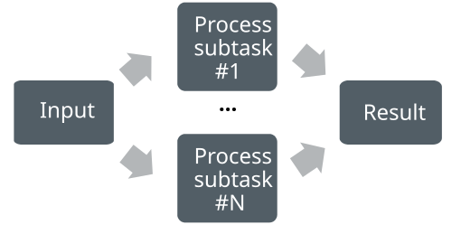
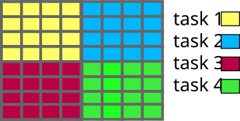
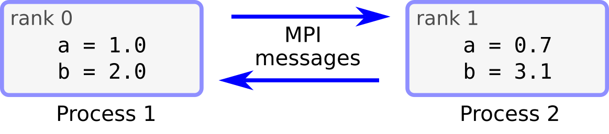

# Parallel computing concepts {.section}

# Supercomputer anatomy

{.center width=50%}

# Computing in parallel

- Parallel computing
    - A problem is split into smaller subtasks
    - Multiple subtasks are processed simultaneously using multiple cores/GPUs

<br>
<div class=column>
<!-- Copyright CSC -->
 {.center width=80%}
</div>
<div class=column>
{.center width=90%}
</div>

# Types of parallel problems

- Tightly coupled
    - Lots of interaction between subtasks
    - Weather simulation
    - Low latency, high speed interconnect is essential
- Embarrassingly parallel
    - Very little (or no) interaction between subtasks
    - Sequence alignment queries for multiple independent sequences in bioinformatics


# Exposing parallelism

<div class=column>
- Data parallelism
    - Data is distributed across cores
    - Each core performs simultaneously (nearly) identical operations with different data
    - Cores may need to interact with each other, e.g. exchange information about data on domain boundaries
</div>
<div class=column>

<!-- Copyright CSC -->
 {.center width=80%}

</div>

# Exposing parallelism

- Task farm (master / worker)

<!-- Copyright CSC -->
 {.center width=60%}

<br>

- Master sends tasks to workers and receives results
- There are normally more tasks than workers, and tasks are assigned dynamically

# Parallel scaling

<div class=column>
- Strong parallel scaling
    - Constant problem size
    - Execution time decreases in proportion to the increase in the number of cores
- Weak parallel scaling
    - Increasing problem size
    - Execution time remains constant when number of cores increases in proportion to the problem size
</div>
<div class=column>

<!-- Copyright CSC -->
 {.center width=80%}

</div>

# What limits parallel scaling

<div class=column style=width:60%>
- Load imbalance
    - Variation in workload over different execution units
- Parallel overheads
    - Additional operations which are not present in serial calculation
    - Synchronization, redundant computations, communications
- Amdahl’s law: the fraction of non-parallelizable parts limits maximum speedup
</div>
<div class=column style=width:38%>
  {.center width=100%}
</div>


# Parallel programming {.section}

# Parallel programming models

- Parallel execution is based on threads or processes (or both) which run at the same time on different CPU cores
- Processes - MPI (Message passing interface)
    - Independent execution units
    - Have their own state information and *own memory* address space
    - Interaction is based on exchanging messages between processes
- Threads - OpenMP, pthreads
    - Have their own state information, but *share* the *same memory*
  address space
    - Interaction is based on shared memory, i.e. each thread can access directly other threads data

# Parallel programming models

<!-- Copyright CSC -->
 {.center width=80%}
<div class=column>
**MPI: Processes**

- MPI launches N processes at application startup
- Processes communicate by exchanging messages
- Works over multiple nodes
</div>
<div class=column>

**OpenMP: Threads**

- Threads share memory space
- Threads are created and destroyed  (parallel regions)
- Limited to a single node

</div>

# GPU programming models

- GPUs are co-processors to the CPU
- CPU controls the work flow:
  - *offloads* computations to GPU by launching *kernels*
  - allocates and deallocates the memory on GPUs
  - handles the data transfers between CPU and GPUs
- GPU kernels run multiple threads
    - Typically much more threads than "GPU cores"
- When using multiple GPUs, CPU runs typically multiple processes (MPI) or multiple threads (OpenMP)

# GPU programming models

{.center width=40%}
<br>

- CPU launches kernel on GPU
- Kernel execution is normally asynchronous
    - CPU remains active
- Multiple kernels may run concurrently on same GPU

# Parallel programming models

{.center width=100%}

# MPI - Message-passing interface {.section}

# Processes and threads

{.center width=85%}

<div class="column">

**Process**

- Independent execution units
- Have their own state information and *own memory* address space

</div>

<div class="column">

**Thread**

- A single process may contain multiple threads
- Have their own state information, but *share* the *same memory*
  address space

</div>

# Execution model in MPI

- Normally, parallel program is launched as a set of *independent*, *identical
  processes*
    - execute the *same program code* and instructions
    - processes can reside in different nodes (or even in different computers)
- The way to launch parallel program depends on the computing system
    - **`mpiexec`**, **`mpirun`**, **`srun`**, **`aprun`**, ...
    - **`srun`** on LUMI, Mahti, and Puhti

# MPI ranks

<div class="column">
- MPI runtime assigns each process a unique rank (index)
    - identification of the processes
    - ranks range from 0 to N-1
- Processes can perform different tasks and handle different data based
  on their rank
</div>
<div class="column">
```c
double a;
if (rank == 0) {
   a = 1.0;
   ...
}
else if (rank == 1) {
   a = 0.7;
   ...
}
...
```
</div>

# Data model

- All variables and data structures are local to the process
- Processes can exchange data by sending and receiving messages

{.center width=100%}

# Compiling and running MPI programs {.section}

# Compiling an MPI program

- MPI is a library (+ runtime system)
- In principle, MPI programs can be built with standard compilers
  (`gcc` / `g++` / `gfortran`) with the appropriate `-I` / `-L` / `-l`
  options
- Most MPI implementations provide convenience wrappers, typically
  `mpicc` / `mpicxx` / `mpif90`, for easier building
    - MPI-related options are automatically included

```bash
mpicc -o my_mpi_prog my_mpi_code.c
mpicxx -o my_mpi_prog my_mpi_code.cpp
mpif90 -o my_mpi_prog my_mpi_code.F90
```

# Compiling an MPI program on LUMI

- On LUMI (HPE Cray EX), there are `cc` / `CC` / `ftn` compiler wrappers
  invoking the correct compiler
  - use these instead of the `mpi*` wrappers

```bash
cc -o my_mpi_prog my_mpi_code.c
CC -o my_mpi_prog my_mpi_code.cpp
ftn -o my_mpi_prog my_mpi_code.F90
```

# Running an MPI program

- On a laptop or workstation MPI program can be started from the command line with the
`mpiexec` launcher:
```
$ mpiexec -n 4 ./myprog
```
- On a supercomputer, one should use the batch queuing system. The **launcher** command 
  depends on the queuing system, in Slurm the command is `srun`


