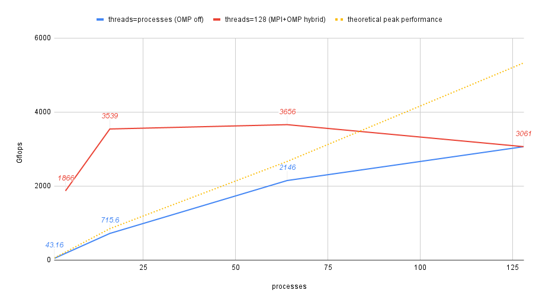

# Deliverable for SCC Training 04

The N and NB sizes I was using were the following for the different process counts:

|Process count|N value|NB value|Gflops|
|---|---|---|---|
|1|5376|128|42.05|
|1|5376|196|42.76|
|1|5376|224|42.93|
|1|5376|768|43.16|
|16x1|65408|192|715.6|
|64x1|65408|224|2146|
|4x32|65536|224|1866|
|16x8|65536|224|2904|
|16x8|155008|224|3539|
|64x2|65536|224|3209|
|64x2|155008|224|3656|
|128|155136|128|3061|

consult each folder for respective HPL.dat & slurm script.

## notes to self

- for single process mode a huge NB improved performance. L3 unsaturated?
- per documentation there are 8 numa nodes across 2 sockets, or 16 ccx's for L3 assoc => mpi tasks 16 should be optimal. weirdly 64x2 is better than 16x8. poor omp optimization?
- aocc attempted with amdlibm and amdblis, performance worse. further investigation.
- <https://www.servethehome.com/amd-epyc-7h12-64-cores-and-even-faster-new-supermicro-gpu-servers/> 4.2 Tflops reported for 7H12 specifically. besides tuning, memory bandwidth constraint? power budget?
