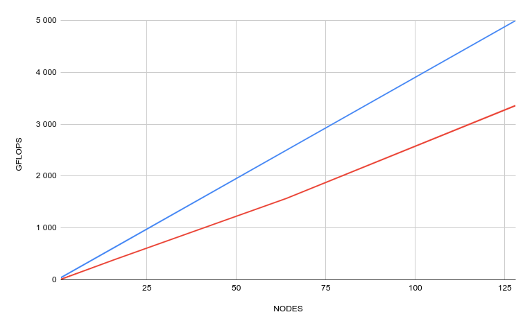

# Deliverable for SCC Training 04

1. The N and NB sizes I was using were the following for the different process counts:

|Process count|N value|NB value|
|---|---|---|
|1|13272|2|
|16|53088|64|
|64|106112|128|
|128|165760|256|

2. My Slurm script was the following:

```
#!/bin/bash
#SBATCH --account=project_2009905
#SBATCH --job-name=HPL_KIM
#SBATCH --time=0:59:00
#SBATCH --nodes=1
#SBATCH --ntasks-per-node=128
#SBATCH --cpus-per-task=1
#SBATCH --partition=test

srun xhpl
```

3. Performance from HPL visualized



I used Google sheets to visualize the data.  
You can find the data here: [googlesheets/HPL_Performance](https://docs.google.com/spreadsheets/d/1eeil4SyN2jLQ-t8ZYf_w5zSZ8Az3vGcQNg2U5A87KBI/edit?usp=sharing)

4. The HPL.dat file I used for my best run was the following:

```
HPLinpack benchmark input file
Innovative Computing Laboratory, University of Tennessee
HPL.out      output file name (if any) 
6            device out (6=stdout,7=stderr,file)
1            # of problems sizes (N)
165760       Ns
1            # of NBs
256          NBs
0            PMAP process mapping (0=Row-,1=Column-major)
1            # of process grids (P x Q)
16           Ps
8            Qs
16.0         threshold
1            # of panel fact
2            PFACTs (0=left, 1=Crout, 2=Right)
1            # of recursive stopping criterium
4            NBMINs (>= 1)
1            # of panels in recursion
2            NDIVs
1            # of recursive panel fact.
1            RFACTs (0=left, 1=Crout, 2=Right)
1            # of broadcast
1            BCASTs (0=1rg,1=1rM,2=2rg,3=2rM,4=Lng,5=LnM)
1            # of lookahead depth
1            DEPTHs (>=0)
2            SWAP (0=bin-exch,1=long,2=mix)
64           swapping threshold
0            L1 in (0=transposed,1=no-transposed) form
0            U  in (0=transposed,1=no-transposed) form
1            Equilibration (0=no,1=yes)
8            memory alignment in double (> 0)
```
