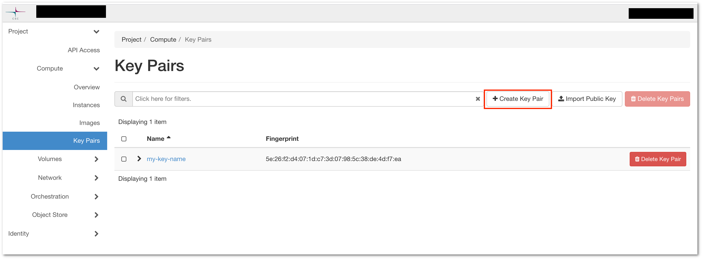
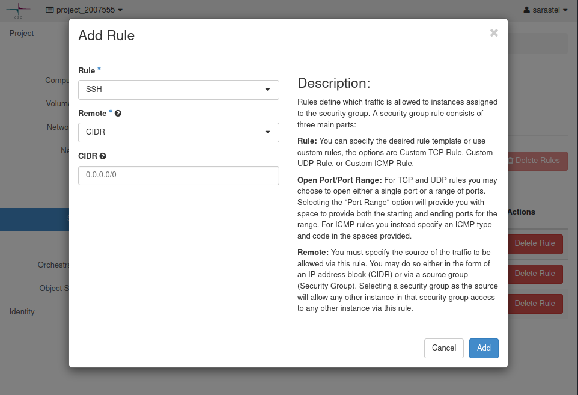
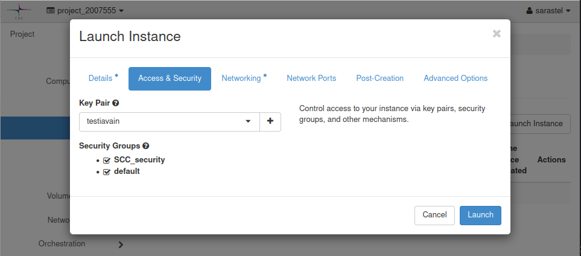

# Using a single node with cPouta

This tutorial will walk the user through the process of creating a single node in cPouta from scratch.

To start with, we go to the cPouta platform at: https://pouta.csc.fi/dashboard/auth/login/?next=/dashboard/.

After logging in with your CSC user, select the SCC23 project (2007555) from the top left dropdown menu.

Immediately, in the `Overview` tab, you can find the resources you have access to and their usage limits.

**The resources are limited, actively deallocate any resource you aren't anymore using**

## Creating a key pair

Before we can create a compute node, we need to do a few preparatory steps.
First, we create a key pair for connecting to resources in the future through cPouta.

Navigate to `Compute -> Key Pairs`.  
Import your own public key using the `Import Public Key` option, or create a new key pair through the system.

## Setting up a security group

Next, we create a security group for handling access to resources we will create later.  
The security group can be set up to allow access from your network to the cluster, while preventing unwanted intrusions.

Let's create a security group to suit our purposes in this case.

1. Navigate to `Network -> Security Groups`
    - **Note! Don't change the rules in the default security group**
2. Select `Create Security Group`
    - Give it a name and click `Create`
3. Select `Manage Rules` for your new Security group
    - Click the `Add Rule` option
4. Select `Rule` and choose `SSH`, as instructed in the image below. Add your IP address to the CIDR input.  
    You can check your IP at: https://apps.csc.fi/myip/

## Creating a single compute node

Now, we can move to reserving a compute node.

Navigate to `Compute -> Instances`.

Select `Launch Instance`. We need to change at least the following options in the popup screen:

1. Instance name
2. Flavor
    - For basic (CPU) testing, choose the `standard.tiny` flavor
    - Full list of flavors: https://docs.csc.fi/cloud/pouta/vm-flavors-and-billing/
3. Instance Boot Source
    - Select `Boot from image`
    - Select `Image Name` as an OS of your choice (CentOS / Ubuntu)
4. Access & Security
    - Choose the key pair that we created earlier
    - Select the default security group and the one you set up for your own IP
    - 

Select `Launch`. Initializing the node usually takes a few seconds.

## Connecting

For accessing the node through our terminal, we need to set a **Floating IP** to it.  
In the `Instances` screen, in the "Actions" menu, select `Associate Floating IP` to your newly created node.  
Click the "+" button to create a new IP, give it a name, allocate it with `Allocate IP`, and click `Associate`.

On an Ubuntu image, type `ssh ubuntu@<floating_ip>` on a terminal on your laptop to gain access to the system.  

On `CentOS-8-Stream` username is `centos` so use `ssh centos@<floating_ip>`. Other CentOS images might use `cloud-user`.

## Deleting unused resources

After you're no longer using a resource (Instance / Floating IP), please delete it.

Delete an *instance* by navigating to `Compute -> Instances`. Select the instance(s) you want to delete and click `Delete Instances`.

Delete a *floating IP* by navigating to `Network -> Floating IPs`. Select `Release Floating IP`.
