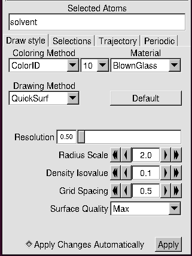

These instructions are taken from IndySCC 2022's NAMD exercise, but modified for running with NAMD 3.0 and on Mahti.  
Link to the original exercise: https://gitlab.msu.edu/vermaaslab/indysccnamd/-/blob/main/Homework.md

# NAMD

In this exercise you will be installing NAMD from its source code for Mahti.  
We will build an "SMP" enabled version, meaning that NAMD during runtime will reserve one process for communication during runtime, which in turn can be useful when scaling up your runs with NAMD.

# Installing NAMD

First, you will need the source code on your system. 

Copy the tar file in `/scratch/project_2009905/pool/NAMD_3.0_Source.tar.gz` into your working folder on Mahti and untar the following directories there:

```
tar -zxf NAMD_3.0_Source.tar.gz
cd NAMD_3.0_Source
tar -xf charm-8.0.0.tar
```

Then, you can build the first dependency, the charm++ runtime library with the following command:

```
cd charm-8.0.0
./build charm++ mpi-linux-x86_64 <optional options> --with-production -j8
```
Enable the SMP option and MPICXX wrappers as the optional options. See the [Charm++ manual](https://charm.readthedocs.io/en/latest/charm++/manual.html#installing-charm) for details.

This should build Charm++, and get you ready to build NAMD proper, once we have the other preliminaries dealt with.
NAMD's configuration file is really a tcl script, and so we need a tcl library in place.
We additionally need a fast fourier transform library to do long-range electrostatics.
We can get versions that work from the NAMD developers, but do keep in mind that licensing means that the versions distributed this way are ancient, and may be a way to boost the performance by modernizing these libraries.

```
cd ..
wget http://www.ks.uiuc.edu/Research/namd/libraries/fftw-linux-x86_64.tar.gz
tar xzf fftw-linux-x86_64.tar.gz
mv linux-x86_64 fftw
wget http://www.ks.uiuc.edu/Research/namd/libraries/tcl8.5.9-linux-x86_64.tar.gz
wget http://www.ks.uiuc.edu/Research/namd/libraries/tcl8.5.9-linux-x86_64-threaded.tar.gz
tar xzf tcl8.5.9-linux-x86_64.tar.gz
tar xzf tcl8.5.9-linux-x86_64-threaded.tar.gz
mv tcl8.5.9-linux-x86_64 tcl
mv tcl8.5.9-linux-x86_64-threaded tcl-threaded
```

Now, before we configure our Makefile, to get the most performance out of the binary, you want to modify some compiler flags that NAMD will use during compiling.  
Here, you can optionally open the file `arch/Linux-x86_64-g++.arch` with your favorite text editor and add some (possibly) performance-improving compiler flags at the end of the line `CXXOPTS`. 

You can play around with [many of the different options](https://gcc.gnu.org/onlinedocs/gcc/Optimize-Options.html), but here are a few that most likely will improve the performance somewhat:  
- `-funroll-loops`
- `-march=native`
- `-mavx2`

After this, you're ready to configure the makefile for NAMD and compile it.

```
./config Linux-x86_64-g++ --charm-arch mpi-linux-x86_64-smp-mpicxx
cd Linux-x86_64-g++/
make -j8
```

At the end of this configuration and compilation process, you should have a `namd3` binary built and ready.
The best hints for how to control the NAMD compilation process are in the config file, which is really a bash script rather than a part of the autoconf toolchain.
Together with locations specified in the arch directory, which controls where the build process looks for external libraries like FFTW, these are some of the biggest decisions you'll get to make when building NAMD.

# Running NAMD

Now that you have NAMD installed, first you need to download the input of the Apoa1 protein in any directory of your choosing:

```
wget https://www.ks.uiuc.edu/Research/namd/utilities/apoa1.tar.gz
tar -zxf apoa1.tar.gz
cd apoa1
```

Then, create a Slurm script for executing NAMD. You might consult CSC's NAMD documentation for this, just make sure that you use your local installation and not the NAMD module one in Mahti.

Typically, a typical run command with Slurm for NAMD would be along the lines of:

```
srun /path/to/your/namd/namd3 +ppn ${namd_threads} apoa1.namd > apoa1.out
```

Create a slurm script for this, where you leave one core per MPI task to handle communication, and assign all other cores as "namd_threads". Try avoiding hard-coding these thread amounts in your script.

# Benchmarking task

Now, try two cases and analyze the results as instructed in the section below:
1. Run it with 1 MPI task and 16 cores per task, utilizing about an eight of a Mahti node 
2. Run NAMD with 2 MPI tasks and 16 cores per task

Try changing your simulation's cutoff distance from 12 Å to 9 Å.  
Note that switchdist needs to be smaller than the cutoff.

How does changing the cutoff affect the performance?

# Analyzing the results

Look through your results file. Two lines are of main interest to us, namely:

- `WallClock` (Total time taken to run the simulation)
- `Benchmark time` days/ns (how many days of simulation time for a simulated nanosecond)

The benchmark time (days/ns) in itself is useful but might be hard to interpret. Use the python script `ns_per_day.py` in this folder and give it your `.log` file as an input to figure out the "ns simulated per day" values for your runs.

## (Optional) Visualizing the output with VMD

The suggested way is to Download VMD onto your local machine.  
The Source code can be downloaded from: [https://www.ks.uiuc.edu/Development/Download/download.cgi?PackageName=VMD](https://www.ks.uiuc.edu/Development/Download/download.cgi?PackageName=VMD)

For this, you need to create a user on the site per the user agreement.  

Follow the installation instructions, and once you get in, open VMD.

In VMD, open the `apoa1.pdp` file you have been working with. You should instantly see a mesh of colors pop up on the visualization screen.

Let's visualize the protein in a similar manner how the lecturer did.  
For this, you need to change the following three options:

1. First, navigate under `Graphics/Representations` 
2. Delete the default coloring for "All"
3. Select atoms "protein" and choose the Coloring method "SegName", Material "AOChalky" and the Drawing method "NewCartoon"
4. Next, select atoms "lipid" and choose the Coloring method "Type", Material "AOChalky" and the Drawing method "VDW"
5. Finally, implement the background "solvent" material like in the following picture:  


## Additional tuning options

The default configuration parameters in `apoa1.namd` can be really unoptimized and I/O heavy.  
Look for example into the variables `outputTiming` and `outputEnergies` on how you might improve this.

NAMD manual (configuration parameters): https://www.ks.uiuc.edu/Research/namd/2.9/ug/node12.html
