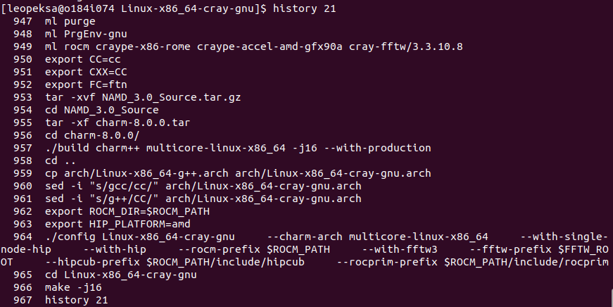

# Working with NAMD on the competition cluster

This guide will show you a step by step guide on how you can install and run NAMD on the testing node from HPE.

## Installing NAMD

NAMD installation requires doing the following steps:

    1. Fetching the source code for NAMD
    2. Untarring the files
    3. Preparing your environment
        * Choosing which compiler to use
        * Setting the right environment variables for the Cray compiling environment
    4. Installing dependencies
        * Charm++ 
        * FFTW 
    5. Creating the correct installation rules for NAMD
        * Creating the `make` script
        * Choosing the right compilation flags
        * Enabling GPUs
    6. Compiling NAMD with `make`
    7. Check that the compilation worked
    
After which, you can download something to simulate and can start running simulations.  
Let's go through the installation steps one by one.

## 1. Fetching the source code

Pre-built NAMD versions and the source code can be downloaded from [https://www.ks.uiuc.edu/Development/Download/download.cgi?PackageName=NAMD](https://www.ks.uiuc.edu/Development/Download/download.cgi?PackageName=NAMD).

You will find many different versions for NAMD. You should pick the newest one which works. 
Based on Leopekka's testing, version 3.0.1 will not work (easily) on AMD GPUs, but 3.0 does. I suggest picking version 3.0.

Create a user to the site or log in with your user ín order to download the source code.  
Copy it to the cluster with the `scp` command.  

Steps after this should be performed on the cluster/testing node. Log in to the system and navigate to a directory where you will work.

## 2. Untarring the files

NAMD and its base dependency Charm++ come with the source code, in a tarred format (e.g `NAMD_3.0_Source.tar.gz`). You should untar these files so that you can start working with them. If the files ends in `.tar.gz`, use the command `tar -zxf` and if it ends in just `.tar`, use `tar -xf`. 

The `x` flag specifies extraction from a `.tar` archive, while the `z` flag filters the extraction with `gunzip` to extract from a gzipped file e.g. a file with a `.gz` extension.  
The `-f` flag is used to specify the file you are operating on.  

Use the command `tar --help` to see all the relevant options.

With this in mind, untar/unzip the two zipped files:

```
tar -zxf NAMD_3.0_Source.tar.gz
cd NAMD_3.0_Source
tar -xf charm-8.0.0.tar
```

## 3. Preparing your environment

Next, you prepare your environment for compilation by choosing the correct modules, and setting the right environment variables, so that your system will know which compilers and libraries it will use to compile NAMD with.

### 3.1 Working with modules - Choosing a compiler

We are working on a HPE provided Cray environment. It has two main compiling environments. One for the Gnu compiler environment, and one for the proprietary Cray compiling environment. 

First and foremost, check your currently loaded modules with `module list` or `ml` to see which environment you have present. By default, the Cray compiling environment, `PrgEnv-cray`, should be present. 

Then, your chosen compiler environment can be activated by loading the right module:

`module load PrgEnv-cray` or `module load PrgEnv-gnu`. They can not exist in the environment at the same time, so you should run the `module purge` command inbetween, when you want to change these environments.

### 3.2 Working with modules - Loading other necessary modules

By default, GNU/CRAY programming environment modules will load a number of other modules to the system for e.g. Interconnect communication, MPI and mathematical libraries. For CPU compilation this is often sufficient.

For us though, we want to compile NAMD for **GPU support**, so we want to include a few extra modules to achieve this. Namely, we want `rocm`, that programs use to implement GPU functionality in their code, we want the environment modules `craype-x86-rome`and `craype-accel-amd-gfx90a` that will set a number of environment variables that allow for compilers to compile architecture-specific-code in a working and more performant way.

On top of these, we also want "FFTW library" support, for the Fast Fourier transformations that NAMD employs during a **Particle Mesh Ewald (PME)** phase in its simulation, that is used to calculate long-range electrostatics (forces outside of cutoff distance) for all particles.

This library support is in the system in the form of a module called `cray-fftw`.

In total, we thus want to purge old modules and load our specific environment:

```
module purge
module load PrgEnv-gnu
module load rocm craype-x86-rome craype-accel-amd-gfx90a cray-fftw/3.3.10.8
```

In Leopekka's tests, he had the following module listing after loading this environment:

```
[leopeksa@o184i074 ~]$ ml
Currently Loaded Modulefiles:
  1) gcc-native/13.2           7) PrgEnv-gnu/8.5.0
  2) craype/2.7.32             8) rocm/6.2.2
  3) cray-dsmml/0.3.0          9) craype-x86-rome
  4) craype-network-ofi       10) craype-accel-amd-gfx90a
  5) cray-mpich/8.1.30        11) cray-fftw/3.3.10.8
  6) cray-libsci/24.07.0
```

### 3.3 Setting environment variables for the Cray environment

Typically, C/C++/Fortran codes look for which compiler to use by using the environment variables `CC/CXX/FC`.  
Let's set these to match the compiler wrappers that are used in the Cray stack (for both GNU and Cray compilers, depending on which module is loaded).

Let's also set the environment variable ROCM_DIR and HIP_PLATFORM that GPU compilation of NAMD requires in our case.

```
export CC=cc
export CXX=CC
export FC=ftn
export ROCM_DIR=$ROCM_PATH
export HIP_PLATFORM=amd
```

## 4. Installing dependencies

NAMD requires the charm++ library in the system, that it uses to handle parallelism and load balancing between processes, similarly to MPI/OpenMP in typical modern software. When you download NAMD, Charm++ comes packaged with the download, at the root of NAMD as `charm-8.0.0.tar`. We already untarred the file in step 2, so now we just need to install it. 

Charm++ uses a build system for configuring and installing itself. Detailed instructions and options for this can be found in the Charm++ manual: [https://charm.rtfd.io/en/latest/charm++/manual.html#installing-charm](https://charm.rtfd.io/en/latest/charm++/manual.html#installing-charm).

We will just go into the Charm++ folder, and compile a basic version of it without SMP support, for a basic multicore Linux system. We achieve this with the following configuration:

```
cd charm-8.0.0/
./build charm++ multicore-linux-x86_64 -j16 --with-production
cd ..
```

Nothing more fancy is needed, since we will just be running NAMD on a singular node, as it performs the best in the singullar node "GPU resident" mode, as we will discuss later.

Another base dependency for NAMD is FFTW, which is already installed in the system, and can be loaded into the environment as we did in step 3.2.

## 5. Creating the correct installation rules for NAMD

Now, we have a working version of Charm++ and FFTW, and can move into compiling NAMD itself. Start working from the root directory of your NAMD folder in these next steps.

To create a "make" script for the environment that NAMD uses for compiling, it needs to know which compilers and compiler flags it will use. For this, it uses "architecture" files that end in `.arch`.

NAMD has a number of pre-defined configurations that can be used to compile NAMD for known systems, like a basic Linux installation. These ready-made configuration scripts can be found in the folder `arch/.`.

Our system uses the wrappers `cc` and `CC` for C/C++ compilation respectively, so we need to set this to our configuration file. We can achieve this by taking one of the readymade files for gnu compilation, e.g. `arch/Linux-x86_64-g++.arch`, and just changing the chosen compiler to be our desired compiler wrappers `cc` and `CC`, instead of the `gcc` and `g++` that are in the file. In this step, you could also change the flags if you want to try tuning the execution. Try first with the default options, and then later try to change these options if you have time. 

To achieve the correct configuration file, let's copy the file and rename it to `Linux-x86_64-cray-gnu.arch` to reflect our system environment better, and change the compiler names in this file. You can do this manually, or by using the `sed` command in Linux, that is a handy tool for changing text in files on the command line, as we do in the example below.

```
cp arch/Linux-x86_64-g++.arch arch/Linux-x86_64-cray-gnu.arch
sed -i "s/gcc/cc/" arch/Linux-x86_64-cray-gnu.arch
sed -i "s/g++/CC/" arch/Linux-x86_64-cray-gnu.arch
```

Now, you have your configuration ready, and can run the next step, which is to run the executable `configure` in NAMD's root folder, that will take the `.arch` file you specify, and will create a `make` file for this environment, that you can use to compile NAMD.

The config executable can take a number of flags and inputs for configuring your NAMD in just the right manner that it finds all libraries in your environment and uses the correct hardware (CPUs and/or GPUs, AMD GPUs or Nvidia GPUs, single-node or multi-node, etc.). You can find all the options available by testing the command `./config --help`.

For our system, we are using AMD GPUs, that use the ROCm/HIP GPU programming language, and we want to configure our system to be run on just a single node, with the so-called "GPU-resident" mode, that runs much more efficiently on small clusters. An example configuration with this in mind would be:

```
./config Linux-x86_64-cray-gnu \
    --charm-arch multicore-linux-x86_64 \
    --with-single-node-hip \
    --with-hip \
    --rocm-prefix $ROCM_PATH \
    --with-fftw3 \
    --fftw-prefix $FFTW_ROOT \
    --hipcub-prefix $ROCM_PATH/include/hipcub \
    --rocprim-prefix $ROCM_PATH/include/rocprim
```

Notice, that the configuration script uses environment variables `ROCM_PATH`, `FFTW_ROOT`, etc. for setting the right paths for these libraries. These environment variables are automatically set by the modules you loaded earlier into the system. (e.g. the `fftw` and `rocm` modules)

## 6. Compiling NAMD with `make`

After this, you should now have a folder in your root folder called `Linux-x86_64-cray-gnu`, that contains all the compilation information that NAMD will require. Go to that folder, and run the `make` command there. Use multiple cores during the compilation by using the `-j` flag to speed up the process.

```
cd Linux-x86_64-cray-gnu
make -j16
```

## 7. Check that the compilation worked

Now, in the `Linux-x86_64-cray-gnu` folder, you should see a `namd3` executable if everything worked.  
Next step is to check that you can run simulations on the cluster with GPUs. For this, follow the instructions in the file [running_NAMD_stepbystep.md](./running_NAMD_stepbystep.md).

## 8. Document your steps

In the terminal, you can see your command history with the `history <n.o of commands>`.

Run the command to see the commands you did to achieve a working installation, and save the listing to a file, or into GitHub, so that you can easily reproduce the process or to show it to a judge.

For me, the command looks like:

