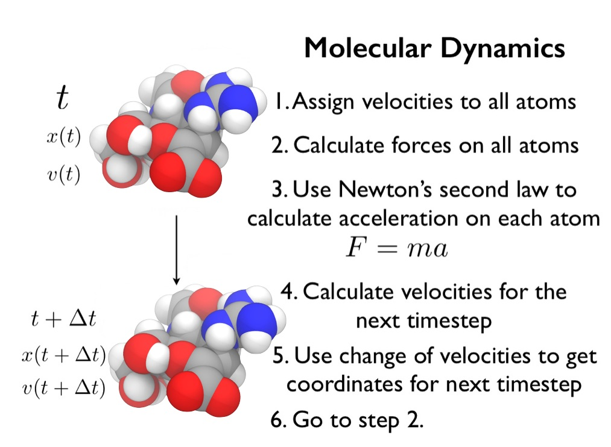
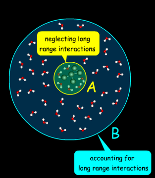

# Running NAMD

After installing NAMD, you now have an executable called `namd3` in the build directory (e.g. under a folder like `Linux-x86_64-cray-gnu`).

Everything starts with the executable, for which you give runtime options, as well as the input file (simulation data) you want to run NAMD on.

Your typical setup consists of the following steps:

    1. Identifying where your namd3 executable resides
    2. Downloading some set of data for NAMD (e.g. apoa1 protein)
    3. Identifying and/or modifying the configuration file
    4. Running the simulation with the desired amount of resources

Let's look at this step by step for a GPU installation of NAMD

## 1. Identifying where your namd3 executable resides

Check where your `namd3` file is. Typically, it would be under the build directory `NAMD_3.0_Source/<arch>/`. If you have compiled multiple configurations of NAMD (e.g. CPU and GPU), you might have different architecture folders to choose from for the executable.

Try that it works, by either navigating to the folder where the executable is and typing `./namd3 --help` or using the full path, e.g. `/home/$USER/NAMD_3.0_Source/Linux-x86_64-cray-gnu/namd3 --help`.

If you work on NAMD often and don't change installation paths too much, you can also add the executable to the environment variable `$PATH`, by typing in `export PATH=$PATH:/<path-to-namd3/namd3>`. That way, whenever you invoke just the command `namd3`, your local login will know where the executable resides and invokes it automatically. 

Check that the path looks correct by typing `echo $PATH`. 

## 2. Downloading a set of data

Typically, you are given a few files to run for NAMD.

    1. Molecule structure file (.psf)
    2. Coordinate file (.pdp)
    3. NAMD configuration file (.namd / .conf)

The molecule structure and coordinate files are something you should not modify unless you're explicitly told to do so.  
These files contain the starting places for your molecule(s).

The example case we have used so far can be downloaded by running the command: `wget https://www.ks.uiuc.edu/Research/namd/utilities/apoa1.tar.gz`.

If you want to find other simulation sets for testing, you can look for them in [https://www.ks.uiuc.edu/Research/namd/utilities/](https://www.ks.uiuc.edu/Research/namd/utilities/), and use a similar command as above for downloading them.

## 3. Identifying and/or modifying the configuration file

The configuration file you can change freely, and different options in it will modify the behavior of your NAMD simulation. 

To know what to change, you have to know how the simulation runs itself, NAMD takes the initial places for atoms in your simulation from the initial (.psf / .pdp) files, and starts to employ Newtonian forces between these atoms, each step iterating the simulation a tiny bit forward.



Calculating the forces between each atom pair in large systems of over 100 000's of atoms would be computationally extremely intensive (for a million atoms this would become > 10^11 pairs to calculate every timestep!). Instead, NAMD opts to calculate only the closest neighbors for each of its atoms, while approximating the forces outside of the close sphere of influence through an approximation procedure.



To get a more detailed understanding of the physics behind it all, please look at the webinar provided in Google classroom, or check online, e.g. [https://www.drugdesign.org/chapters/molecular-dynamics/#fundamental-issues](https://www.drugdesign.org/chapters/molecular-dynamics/#fundamental-issues).

With the theory in mind, you should first focus on a couple of configuration parameters for your NAMD simulation, and then look at other possible ones to improve on:

### Parameter: timestep <decimal>

A default timestep in NAMD is 1.0 (femtoseconds), and can be represented as a decimal. The amount of calculation after each timestep is about constant. Thus, as you increase your timestep, your simulation can advance further in simulated time (nanoseconds), with the same amount of calculation done.

Although, based on how the simulation works, the finer your timestep is, the more accurate results for the behavior of the system you will get.  
If you increase the timestep too much though, the behavior of your simulation might become very chaotic and inaccurate.

#### Parameter: numsteps <integer>

Total amount of timesteps you simulate your program for.

#### Parameter: outputtiming <integer>

How often your simulation writes to standard output the status of the timestep that its currently on.

#### Parameter: outputname <path>

Where the output of the final coordinates and velocities of the atoms in your simulation will be written into.

#### Parameter: outputEnergies <integer>

How often NAMD outputs all energy values of the atoms for the user's information. By default this is done every single step, and thus can be extremely heavy on the performance.

#### Parameter: switchdist <decimal> (Å)

Distance at which to activate switching function for electrostatic and van der Waals calculations. (Should have a smaller value than cutoff)

#### Parameter: cutoff <decimal> (Å) 

Local interaction distance common to both electrostatic and van der Waals calculations. See [https://www.ks.uiuc.edu/Research/namd/2.6/olddocs/ug/node24.html#section:electdesc](https://www.ks.uiuc.edu/Research/namd/2.6/olddocs/ug/node24.html#section:electdesc).  
The smaller the cutoff, in effect the less computational time is spent on the computationally heavy short-range interactions.

#### Other parameters

All namd parameters and their descriptions can be found in NAMD's user tutorial. 

- [https://www.ks.uiuc.edu/Research/namd/3.0.1/ug/node12.html](https://www.ks.uiuc.edu/Research/namd/3.0.1/ug/node12.html)
- [https://www.ks.uiuc.edu/Research/namd/3.0.1/ug/node25.html#SECTION00082100000000000000](https://www.ks.uiuc.edu/Research/namd/3.0.1/ug/node25.html#SECTION00082100000000000000)

## 4. Running the simulation with the desired amount of resources

Next, decide on what kind of resources you want to run your simulation on (How many CPUs & GPUs).

NAMD uses Charm++ for distributing work and for handling the GPUs, which means that the user shouldn't provide more MPI tasks than just a single one. NAMD can use multiple CPUs though, so the user should specify the amount for this. 

For NAMD, this amount of resources are handled by runtime options, namely:

- `+p` for handling the amount of processors NAMD can utilize. Using too many can lead to worse performance. Check the user guide.
- `+devices <0,1>` for handling which GPU devices to use (input 0,1 will use both in a node)
- `+pmepe` this is a weird one that I don't really understand fully and gives me worse performance if I try to set it to anything... Check the user guide and try it out if you want to

More details about the options can be found in the [user guide](https://www.ks.uiuc.edu/Research/namd/3.0/ug/node102.html#SECTION0002210200000000000000). 

Write a Slurm script for handling runs, it can be a general Slurm script or you can run things from your terminal. Good idea typically to direct the output of the runs to a file for bookkeeping, with the `>` command.

Example Slurm script:

```
#!/bin/bash
#SBATCH --time=00:05:00
#SBATCH --nodes=1
#SBATCH --ntasks-per-node=1
#SBATCH --cpus-per-task=32

srun -N1 -n1 --cpus-per-task=32 ./namd3 +p 32 +setcpuaffinity +devices 0,1 apoa1/apoa1.namd > apoa1.out
```

Example srun line:

```
srun -N1 -n1 --cpus-per-task=32 ./namd3 +p 32 +setcpuaffinity +devices 0,1 apoa1/apoa1.namd > apoa1.out
```

After running, look for the output file, and check the value for "ns per day".  
Then, try to modify the configuration lines for e.g. the timestep, cutoff distance, etc.. and see how they impact the results.

For running on the CPU version, follow the instructions in the NAMD [Mahti exercise](../../08-NAMD/exercises/README.md).